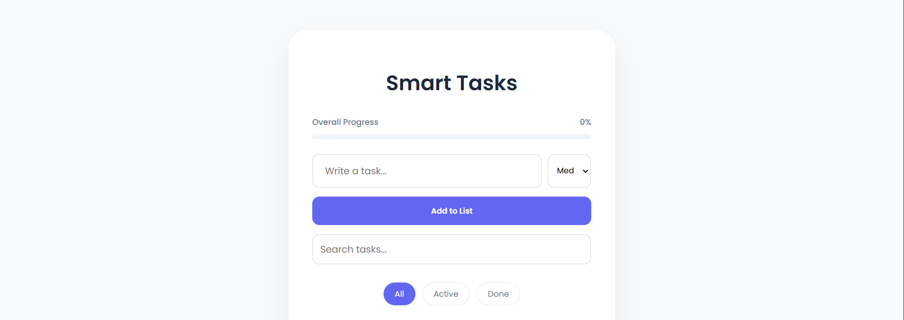
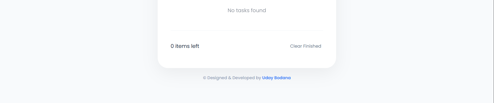

# ✅ To-Do List

A highly functional, premium task management application. Perform full task creation, categorization, and tracking entirely using modern JavaScript and local storage caching.

---

## ✨ Features

- **Full Task Management:** Create, mark complete, edit, and delete tasks dynamically with clean transitions.
- **Priority Categorization:** Assign importance levels (High, Medium, Low) to keep track of urgent items.
- **Dynamic Task Filters:** Toggle and view specific lists easily (All, Pending, Completed).
- **Search Bar:** Real-time text filtering helps you locate exact tasks instantly.
- **Progress Metrics:** Visual progress bar updates dynamically as tasks are checked off.
- **Persistence:** Retains full lists, statuses, and custom priorities across sessions using `localStorage`.

---

## 🚀 How to Use

1. **Add Tasks:** Enter a description, pick a priority, and click the add task button.
2. **Toggle Completion:** Check off completed items to trigger completion metrics and visual styling.
3. **Filter and Search:** Use the search bar or filter buttons to find specific items.

---

## 💻 Tech Stack

- **HTML5**
- **CSS3**
- **JavaScript**

---

## 🏃 How to Run

1. Clone or download this repository.
2. Open `index.html` directly in any web browser, or use a local development server like **Live Server** in VS Code.

---

## 📸 Preview

---

© Designed & Developed by **Uday Bodana**